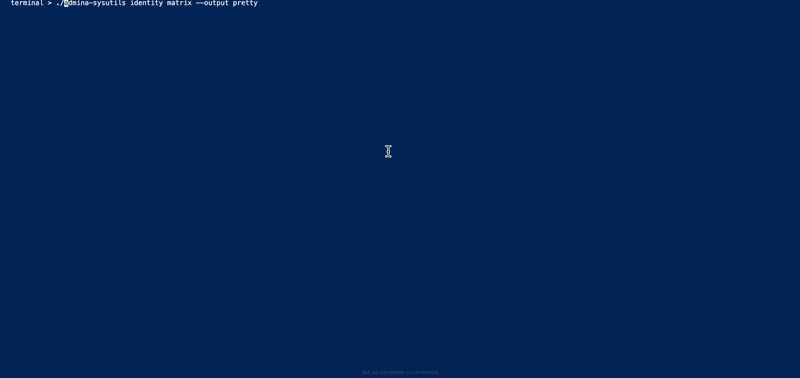
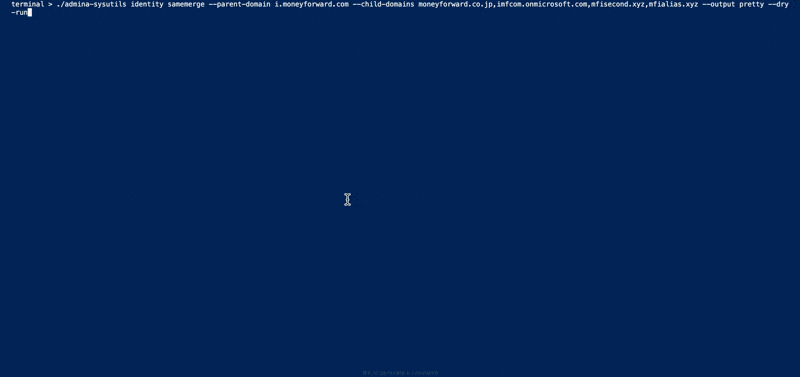

# Admina SysUtils

Admina SysUtils は、管理タスクを自動化するためのコマンドラインツールです。

## インストール

最新バージョンは [こちら](https://github.com/moneyforward-i/admina-sysutils/releases) から取得してください。

以下は各 OS でのセットアップ方法です：

### Windows

1. リリースページから最新の Windows 用バイナリをダウンロードします。
2. ダウンロードしたファイルをパスの通った場所に配置します。（またはパスを通します）

### Mac

1. リリースページから最新の Mac 用バイナリをダウンロードします。
2. ダウンロードしたファイルをパスの通った場所に配置します。（またはパスを通します）

## 使用方法

基本的な使用方法は以下の通りです：

admina-sysutils [グローバルオプション] <コマンド> [サブコマンド] [オプション]

グローバルオプション：

- --help: ヘルプを表示
- --debug: デバッグモードを有効化
- --output <format>: 出力フォーマットを指定（json, markdown, pretty）

## サポートされているコマンド

Admina SysUtils は以下のコマンドをサポートしています：

| コマンド | サブコマンド | オプション                             | 説明                                     | サンプル                                          |
| -------- | ------------ | -------------------------------------- | ---------------------------------------- | ------------------------------------------------- |
| identity | matrix       | --output format (json/markdown/pretty) | 組織のアイデンティティマトリックスを表示 | --output pretty                                   |
| identity | samemerge    | --output format (json/markdown/pretty) | 出力フォーマットを指定                   | --output json                                     |
|          |              | --parent-domain << domain >>           | 親ドメインを指定                         | --parent-domain example.com                       |
|          |              | --child-domains << domains >>          | 子ドメインをカンマ区切りで指定           | --child-domains sub1.example.com,sub2.example.com |
|          |              | --dry-run                              | 実際のマージを実行せずに確認のみ         | --dry-run                                         |
|          |              | --y                                    | 確認プロンプトをスキップ                 | --y                                               |
|          |              | --nomask                               | メールアドレスをマスクしない             | --nomask                                          |
| identity | help         | なし                                   | アイデンティティコマンドのヘルプを表示   | identity help                                     |

## 設定

Admina SysUtils を使用するには、以下の環境変数を設定する必要があります：

- `ADMINA_ORGANIZATION_ID`: あなたの組織 ID
- `ADMINA_API_KEY`: API キー
- `ADMINA_CLI_ROOT`: プロジェクトのルートディレクトリ. この環境変数が設定されていない場合、バイナリを呼び出しているディレクトリをプロジェクトルートとして使用します。

オプションで以下の環境変数も設定できます：

- `ADMINA_BASE_URL`: API のベース URL（デフォルトは https://api.itmc.i.moneyforward.com/api/v1）

## 例

### アイデンティティマトリックスを表示する例：

#### Pretty 形式で表示

> ./admina-sysutils --output pretty identity matrix

### 同一メールアドレスのマージ例：

#### ドライランでマージ候補を確認

> ./admina-sysutils identity samemerge --parent-domain example.com --child-domains sub1.example.com,sub2.example.com --dry-run

#### 確認プロンプトなしで実行

> ./admina-sysutils identity samemerge --parent-domain example.com --child-domains sub1.example.com,sub2.example.com -y

#### メールアドレスをマスクせずに JSON 形式で出力

> ./admina-sysutils identity samemerge --parent-domain example.com --child-domains sub1.example.com,sub2.example.com --nomask --output json

## 標準出力と標準エラー出力

Admina SysUtils のコマンドを実行する際、標準出力にはコマンドの結果が、標準エラー出力にはコマンドの実行ログが出力されます。

### 標準出力と標準エラー出力を別々のファイルに出力する例：

> ./admina-sysutils identity samemerge --parent-domain example.com --child-domains sub1.example.com,sub2.example.com --output json > result.json 2> log.txt

## ヘルプの表示例：

> ./admina-sysutils identity help

## ライセンス

このプロジェクトは Apache License 2.0 の下でリリースされています。詳細は LICENSE ファイルを参照してください。

## 貢献

プロジェクトへの貢献に興味がある場合は、CONTRIBUTE.md を参照してください。
