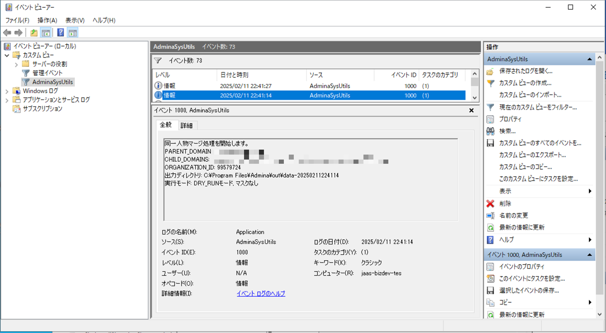
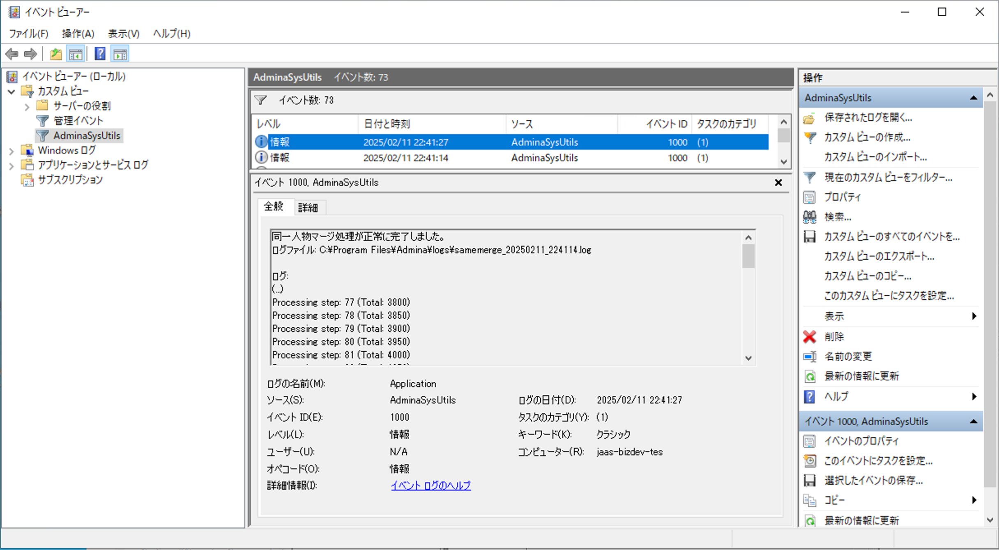
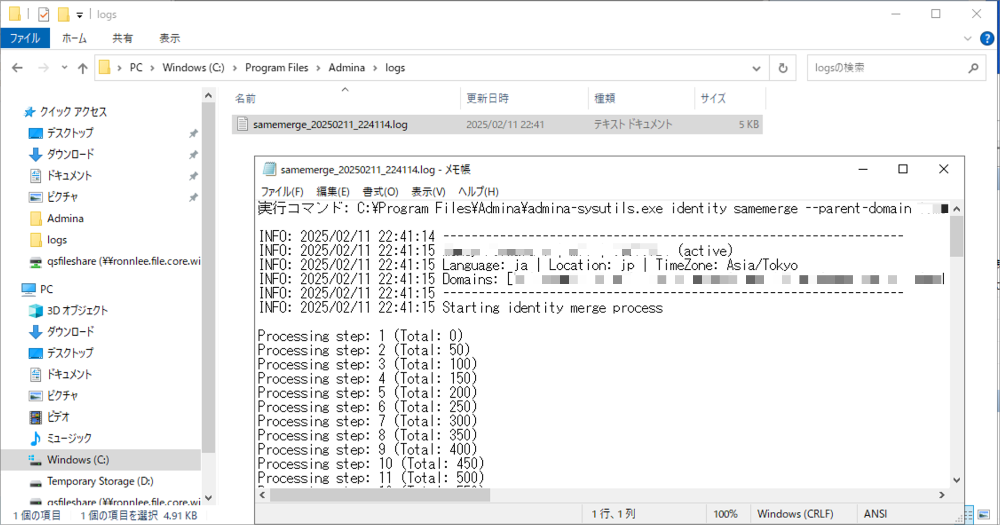

# Admina SysUtils セットアップガイド

このガイドでは、Admina SysUtils を各環境で定期実行するためのセットアップ方法について説明します。

## セットアップ手順

### 1. バイナリのダウンロードと配置

1. [リリースページ](https://github.com/moneyforward-i/admina-sysutils/releases) から最新バージョンをダウンロード
2. ダウンロードした Zip ファイルを任意の場所に解凍
   - 解凍後、`admina`フォルダが作成されます
   - フォルダ内にバイナリ（`admina-sysutils`または`admina-sysutils.exe`）が配置されています

### 2. 環境変数の設定

以下の環境変数を OS 直接または PS ファイルに設定してください：

必須の環境変数：

```
ADMINA_API_KEY=<your-api-key>
ADMINA_ORGANIZATION_ID=<your-organization-id>
```

### 3. ダウンロードした Zip の解凍場所

ダウンロードした Zip ファイルを以下の場所に解凍してください：

- Windows: `C:\Program Files\Admina`
- Linux/Mac: `/usr/local/bin/admina`

## Windows 環境での定期実行設定

### 実行ファイルの準備

提供されているファイルの上部にあるユーザー変数を書き換えることと、
API キーや OrganizationID を環境変数または PS ファイルに直接書いてください。

### PowerShell スクリプトの文字コードについて

PowerShell スクリプト（`samemerge.ps1`）は、UTF-16LE（BOM 付き）で保存されています。
もし文字化けが発生する場合は、以下の手順で文字コードを修正してください：

1. メモ帳でスクリプトファイルを開く
2. 「ファイル」→「名前を付けて保存」を選択
3. 下部の「文字コード」で「UTF-16 LE」を選択
4. 保存して閉じる

この操作により、PowerShell が正しく日本語を処理できるようになります。

### タスクスケジューラで定期実行を設定します

1. タスクスケジューラを開く

   - Windows キー + R を押して `taskschd.msc` を実行

2. 新しいタスクの作成

   - アクション：右側の「タスクの作成」をクリック
   - 全般タブ：
     - 名前：`Admina SysUtils SameMerge`
     - 説明：任意
     - セキュリティオプション：ユーザーがログオンしているかどうかにかかわらず実行する

3. トリガーの設定

   - 「新規」ボタンをクリック
   - 開始：任意の開始日時
   - 毎日または毎週など、適切な間隔を設定
   - 推奨は毎朝 6-8 時頃、1 日 1 回程度の頻度

4. 操作の設定

   - プログラム/スクリプト：`powershell.exe`
   - 引数：`-WindowStyle Hidden -NonInteractive -File "C:\Program Files\Admina\samemerge.ps1"`
   - 開始：(指定なし)

5. 実行確認

   - 手動または自動実行して、実行ログを確認してください。問題なく実行できていればセットアップは完了です。
   - うまく動いているように見えない場合は、後述の確認項目を進めてください。

### ログの確認方法

ログはデフォルトでは Admina フォルダ直下に出力されます。
また Windows イベントビューアーにも追記されます。

- ログファイル：`admina/logs/samemerge_YYYYMMDD_HHMMSS.log`
- イベントビューア：
  - アプリケーションログの「AdminaSysUtils」ソースを確認
  - (カスタムビューを設定しておくと便利です。)

### 正常に動いている場合

正常に動作している場合、以下のようなログが確認できます：

1. イベントビューアーでの開始ログ
   

2. イベントビューアーでの完了ログ
   

3. ログファイルの内容
   

## トラブルシューティング

### Windows 環境でのトラブルシューティング

### タスクスケジューラーがうまく動いていない場合の調査方法

1. ログファイルの確認

   - 指定されたログファイルのパス（`admina/logs/samemerge_YYYYMMDD_HHMMSS.log`）にログファイルが出力されているか確認してください。

2. ログファイルがない場合

   - コマンドプロンプトを開き、以下のコマンドを手動で実行してください。ただし、`-WindowStyle Hidden`や`-NonInteractive`オプションを削除して実行します。
     ```
     powershell.exe -File "C:\Program Files\Admina\samemerge.ps1"
     ```
   - 実行結果を確認し、エラーメッセージや警告が表示されていないか確認してください。

3. イベントビューアーの確認

   - Windows イベントビューアーを開き、アプリケーションログの「AdminaSysUtils」ソースにエラーが出ていないか確認してください。
   - エラーが表示されている場合、その内容を確認し、適切な対策を講じてください。
